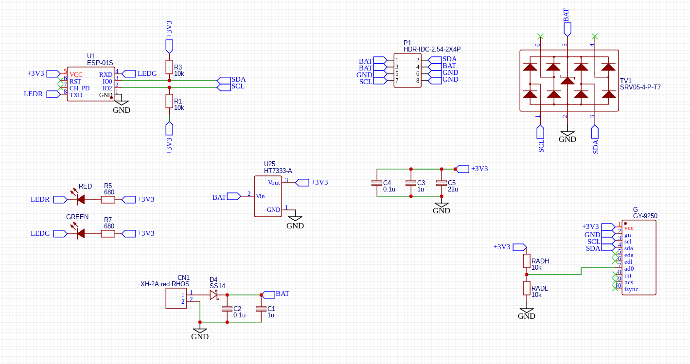
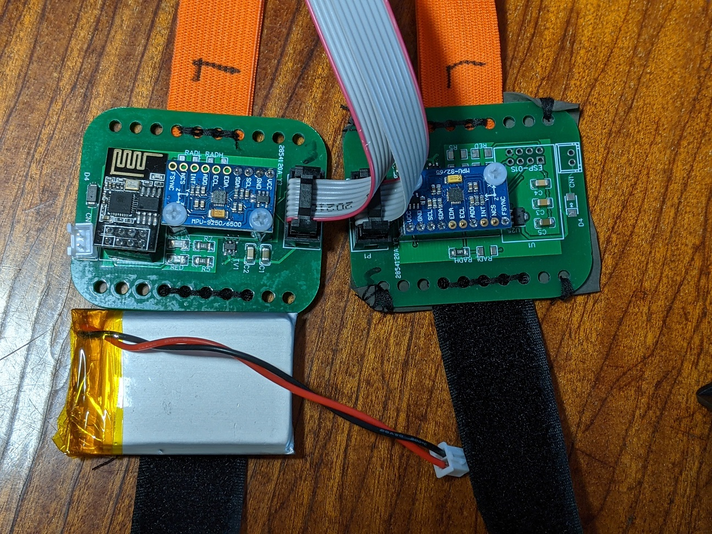
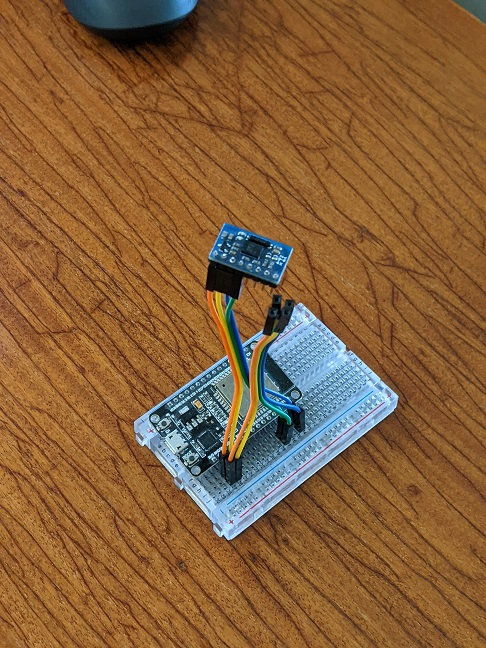

This is a fork of SliveVR tracker. The original project lives there :
[https://github.com/SlimeVR/SlimeVR-Tracker-ESP](https://github.com/SlimeVR/SlimeVR-Tracker-ESP)

The goal of my modification is to adapt existing SlimeVR tracker software to the hardware I have.

I license all the modifications I made under MIT license.
Also, I have included two new dependencies to this project: 

* MPU9250 driver by Kris Winer. Kris Winer states "Library may be used freely and without limit with attribution." 
* Quaternions library by Frank Astier. MIT license.

# Project background

So, I tried to make a SlimeVR tracker out of single ESP-01 (eight-pin WiFi thingy) connected two MPU9250 IMUs.
Here is the problems I faced, which motivated me to create this fork:

* original SlimeVR code was written for ESP-12, which has hardware I2C. ESP-01 does not have SCL/SDA pins exposed, 
leaving only software I2C available (pins 0 and 2).
* apparently, software I2C does not work well with DMP's FIFO. For some reason I was not able to reliable 
read from FIFO. Direct reads from IMU registers are fine.
* handling of magnetometer data looks unconvincing as of Feb 2022 in original SlimeVR code.

# Other notes

It seems like BNO055/BNO080 sensors are first-class IMUs of SlimeVR, with MPU9250 are only receiving only a 
bit of attention. In fact, SlimeVR driver for BNO055 is only few lines of code long, simply copying quaternion data 
from IMU to UDP stack. This allowed me to use BNO055 datasheet as source of truth to determine axis orientation expected by
SlimeVR server software.

# Changes in code

* Removed support for all sensors except BNO055. I can not test them anyway. Though, support can be put back by just 
copying old files and uncommenting links to them.
* I added udplogger.cpp (and .h) to ease debugging for ESP-01. There just not enough pins for UART. Udplogger makes all
<b>Serial.println</b> to be sent to specified UDP port. Here is how to receive it from a linux box: 
<pre>sudo unbuffer tcpdump -i enp2s0f1 -Aqnn udo port 62731 | stdbuf -o0 grep -v 62731 | cut -n 29-</pre>
enp2s0f1 is interface to listen from and 62731 is chosen port. 

* Added a MPU9250 library (taken from Kris Winer). The library somehow reprograms AK8963(magnetometer) to 
disconnect it from 
external I2C and connects it to internal I2C of MPU9250, allowing access to two magnetometers on same I2C bus.
Then magnetometer registers can be read from MPU9250 address space. No FIFO involved.
* I figured out axis orientation of MPU9250 and AK8963. Note that magnetometer is flipped upside down.
* I renamed all the axis so that it became same to BNO055 P0 axis configuration.
* I took original Mahony filter implementation
* This works very well! Needs calibration, though. Please find calibration steps on original SlimeVR website.

# Some pictures

* Pull-up resistors for I2C are not needed. Those present on MPU9250 boards.
* RADL resistor is never needed too, as pull-down presents on MPU9250 boards.
* On the secondary board RADH is present to set address to 0x69
* Standoff length is 11mm
* I chose 1208 (or is it 1206?) as a smallest size I can manually solder
* Do not use steel screws. Or anything of iron or steel. I use nylon screws.
* I forgot on/off switch in my design :)

* Never stick IMUs right into breadboard itself. Breadboards do have some iron in them. I spent good two days
debugging strange magnetometer values. Put IMU on a "stick". The picture shows BNO055 connected to ESP32 through
breadboard.

# Interesting facts

I bought nine MPU-9250 in total. Two from local shop, and seven from aliexpress. Sensors from local shop were fine.
Some of Aliexpress' sensors had some problems:

* Four chips was good
* One sensor was MPU-9255 (whoami value 0x73). That is fine. Totally usable.
* One had broken accelerometer. Z value was stuck
* One had broken or absent megnetometer. Chip was marked MP92M. This is different from all other sensors that was marked just MP92
